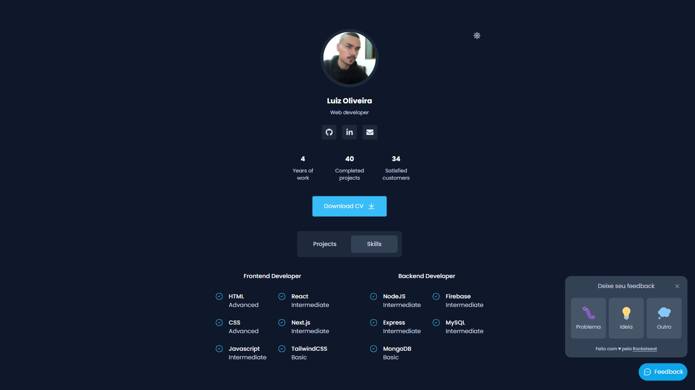

### Feedget + mini portfólio pessoal

Projeto desenvolvido durante a NLW da Rocketseat. Nessa edição desenvolvemos uma aplicação completa (backend, frontend e mobile) onde o usuário é capaz de enviar feedbacks. Após a conclusão do conteúdo da semana, aproveitei para praticar um pouco de TailwindCSS e criei um mini portfólio pessoal com alguns projetos e habilidades que eu possuo

### Tecnologias
- React
- TailwindCSS
- TypeScript
- Headless UI
- Node.js
- Prisma
- Express.js
- Nodemailer
- Mailtrap
- React Native
